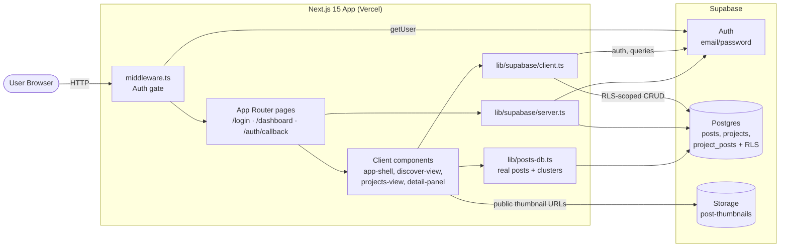
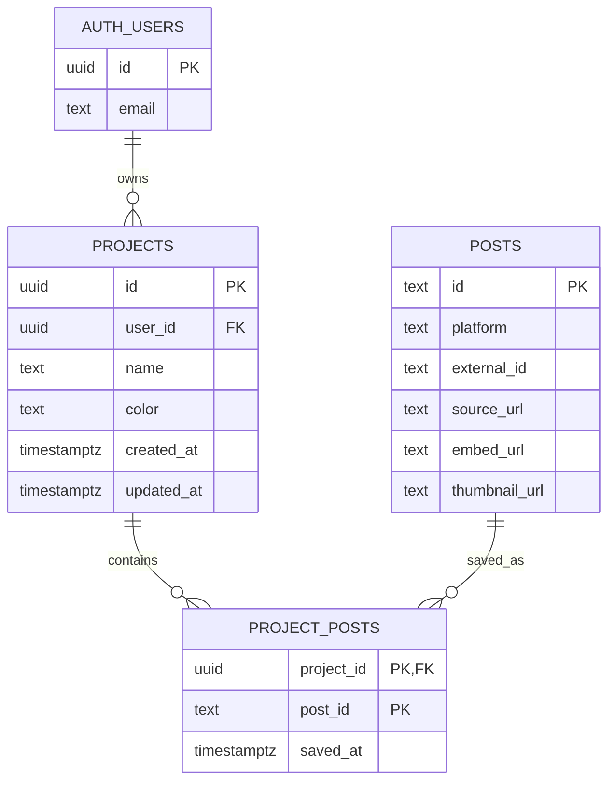

# TrendCue

Discover trending posts across TikTok, Instagram, and X, and organize them into projects.

Built with Next.js 15 (App Router, Turbopack), React 19, Supabase (Auth + Postgres + Storage), and Tailwind CSS v4. Trend posts are loaded from Supabase; TikTok thumbnails are cached in Supabase Storage and detail views use TikTok's embedded player.

## Features

- Email/password auth with Supabase, session managed via SSR cookies in [middleware](src/middleware.ts)
- Strong password policy enforced by Supabase Auth config: 12+ characters with uppercase, lowercase, numeric, and special characters
- Discover view: clustered trending posts with filters, search, and a detail panel
- Projects view: save posts into colored projects scoped per user (RLS-enforced)
- Server and client Supabase helpers in [src/lib/supabase/](src/lib/supabase/)

## Getting started

```bash
cp .env.local.example .env.local   # fill in Supabase URL + anon key
pnpm install
pnpm run dev                        # http://localhost:3000
```

Apply the schema to your Supabase project:

```bash
psql "$SUPABASE_DB_URL" -f supabase/migrations/20260429_initial_schema.sql
```

Apply Supabase project configuration after linking the project:

```bash
supabase config push
```

Scripts: `dev`, `build`, `start`, `lint`.

## System architecture



Request flow: every request passes through [middleware.ts](src/middleware.ts), which refreshes the Supabase session cookie and redirects unauthenticated users to `/login`. The dashboard is a client shell that reads trend posts from Supabase and writes saved posts to Supabase via the browser client. Server components (e.g. [app/page.tsx](src/app/page.tsx)) use the SSR client for the initial auth check.

## Database schema



Notes:

- `auth.users` is managed by Supabase Auth.
- Password hashes are managed by Supabase Auth; the app never stores raw passwords.
- `project_posts.post_id` references real `posts.id`; the foreign key remains `NOT VALID` until legacy mock ids are cleaned up.
- TikTok thumbnails are copied into the public `post-thumbnails` Storage bucket during ingest; the app does not rely on expiring TikTok CDN URLs for cards.
- Every table has RLS enabled. Policies in [supabase/migrations/20260429_initial_schema.sql](supabase/migrations/20260429_initial_schema.sql) restrict reads/writes to rows owned by `auth.uid()`.
- A `projects_updated_at` trigger keeps `updated_at` fresh on update.

## Project layout

```
src/
  app/                Next.js App Router (login, dashboard, auth/callback)
  components/         UI: app-shell, discover-view, projects-view, detail-panel, ...
  lib/
    supabase/         SSR + browser Supabase clients
    types.ts          Post, Cluster, Project, helpers
    posts-db.ts       Supabase post loading + derived clusters
  middleware.ts       Session refresh + auth redirects
supabase/migrations/  SQL schema + RLS
```

## Deployment

Configured for Vercel. The login route is rendered dynamically (no prerender) so Supabase cookies resolve at request time. Set `NEXT_PUBLIC_SUPABASE_URL` and `NEXT_PUBLIC_SUPABASE_PUBLISHABLE_KEY` in the Vercel project environment.
