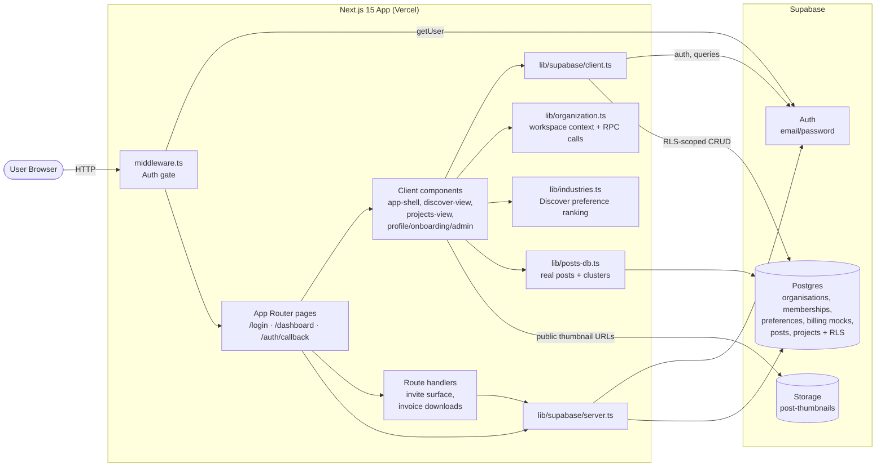
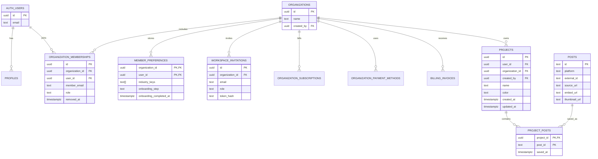

# TrendCue

Discover trending posts across TikTok, Instagram, and X, and organize them into projects.

Built with Next.js 15 (App Router, Turbopack), React 19, Supabase (Auth + Postgres + Storage), and Tailwind CSS v4. Trend posts are loaded from Supabase; TikTok thumbnails are cached in Supabase Storage and detail views use TikTok's embedded player.

## Features

- Email/password auth with Supabase, session managed via SSR cookies in [middleware](src/middleware.ts)
- Strong password policy enforced by Supabase Auth config: 12+ characters with uppercase, lowercase, numeric, and special characters
- Discover view: clustered trending posts with filters, search, and a detail panel
- Profile view: avatar-driven onboarding, industry preferences, account summary, and admin settings
- Organisation workspaces: new sign-ups create an organisation, invited users join an existing one
- Projects view: save posts into colored organisation projects (RLS-enforced)
- Admin mock billing: tier selection, safe payment-method display metadata, invoice history, and invoice downloads
- Team admin: hashed-token invitations, role assignment, revocation, and member removal with last-admin protection
- Server and client Supabase helpers in [src/lib/supabase/](src/lib/supabase/)

## Getting started

```bash
cp .env.local.example .env.local   # fill in Supabase URL + anon key
pnpm install
pnpm run dev                        # http://localhost:3000
```

Apply the schema to your linked Supabase project:

```bash
supabase db push --linked
```

Apply Supabase project configuration after linking the project:

```bash
supabase config push
```

Scripts: `dev`, `build`, `start`, `lint`.

## System architecture



Request flow: every request passes through [middleware.ts](src/middleware.ts), which refreshes the Supabase session cookie and redirects unauthenticated users to `/login`, while allowing `/invite/[token]` so invitees can reach the acceptance surface first. The dashboard is a client shell that reads trend posts, active organisation context, preferences, projects, and admin data through Supabase RLS. Server route handlers verify invoice download access through the same SSR Supabase session.

## Database schema



Notes:

- `auth.users` is managed by Supabase Auth.
- Password hashes are managed by Supabase Auth; the app never stores raw passwords.
- New sign-ups call `create_organisation_for_current_user(org_name)` after auth; invite acceptance calls `accept_workspace_invitation(token)` and does not create a new organisation.
- Roles live in `organization_memberships`, not user-editable auth metadata. MVP roles are `admin` and `member`.
- Active organisation members can read and manage organisation projects. Removed members keep their auth account but lose access through RLS.
- Admin-only rows include workspace invitations, subscriptions, payment methods, and invoices. Members cannot read them through direct Supabase queries.
- Invitation tokens are returned once to the admin UI and stored only as SHA-256 hashes in `workspace_invitations`.
- `project_posts.post_id` references real `posts.id`; the foreign key remains `NOT VALID` until legacy mock ids are cleaned up.
- TikTok thumbnails are copied into the public `post-thumbnails` Storage bucket during ingest; the app does not rely on expiring TikTok CDN URLs for cards.
- Every public table has RLS enabled. Policies authorize through active organisation membership and admin helper functions in the private schema.
- A `projects_updated_at` trigger keeps `updated_at` fresh on update.

## Roles and organisations

The first active membership is used as the current organisation for the MVP. Admins can invite `admin` or `member` users from Profile -> Team, revoke pending invitations, change roles, and remove active members. Database functions prevent removing or demoting the final active admin.

Invited users visit `/invite/[token]`; unauthenticated users are sent through `/login?invite=...` and then the invitation RPC validates that the authenticated email matches the invited email.

## Mock billing

Profile -> Billing exposes `starter`, `growth`, and `scale` mock tiers for admins. Paid tiers require mock card input in the browser, but the app sends and stores only safe display metadata: brand, last4, expiry, billing name/email, and mock provider IDs. No real payment is processed, no full card number or CVC is stored, and Stripe fields are nullable placeholders for a future Checkout or Customer Portal integration.

## Project layout

```
src/
  app/                Next.js App Router (login, invite, dashboard, auth/callback, API)
  components/         UI: app-shell, discover-view, projects-view, profile/admin, ...
  lib/
    supabase/         SSR + browser Supabase clients
    organization.ts   Active organisation context and RPC helpers
    industries.ts     Industry taxonomy and Discover ranking helpers
    billing.ts        Mock tier metadata and safe card helpers
    types.ts          Post, Cluster, Project, organisation, billing types
    posts-db.ts       Supabase post loading + derived clusters
  middleware.ts       Session refresh + auth redirects
supabase/migrations/  SQL schema + RLS
```

## Deployment

Configured for Vercel. The login route is rendered dynamically (no prerender) so Supabase cookies resolve at request time. Set `NEXT_PUBLIC_SUPABASE_URL` and `NEXT_PUBLIC_SUPABASE_PUBLISHABLE_KEY` in the Vercel project environment.

## Testing and Recent Updates

Testing exposed issues with displaying videos. In the process of solving this bug, thumbnails were temporarily removed before video playback and thumbnail functionality was restored. The ability to create a new project from a bookmark was also revealed to be faulty, which was then fixed. 

Onboarding features were also added. This includes features for filtering by industry, which then applies to the homepage. Pricing plans were put in place, and the ability to invite others to a workspace via email was implimented.
