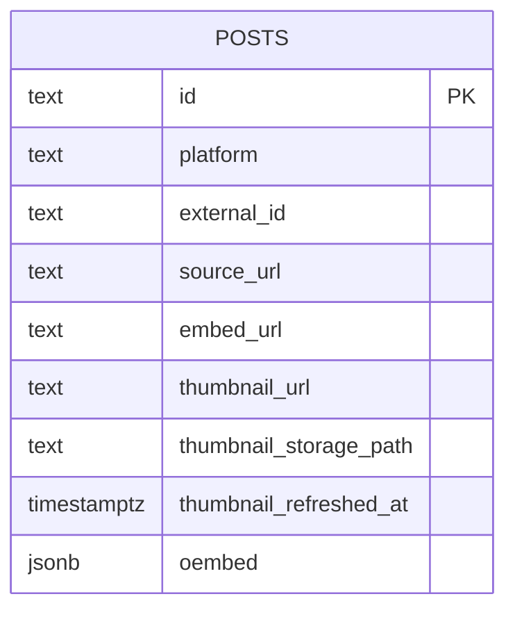

# fix: Stabilize TikTok video rendering

## Overview

TikTok videos currently render as black thumbnails because `posts.thumbnail_url` stores signed TikTok CDN URLs that expire. Search also still returns old mock placeholders from `src/lib/mock-data.ts`. Replace brittle media URLs with durable app-owned thumbnails, add a TikTok iframe player in the detail panel, and make search operate on real `posts` rows.

## Proposed Solution

1. Store durable media metadata for TikTok posts:
   - Add `external_id`, `embed_url`, `thumbnail_refreshed_at`, and either `thumbnail_storage_path` or app-owned `thumbnail_url`.
   - Backfill `external_id` from existing ids like `tiktok:7633094092330667286`.
2. Update `scripts/ingest-tiktok.ts`:
   - Build `embed_url` as `https://www.tiktok.com/player/v1/{external_id}?controls=1&description=0&music_info=0`.
   - Fetch TikTok oEmbed for fresh metadata.
   - Download the oEmbed thumbnail and upload/cache it under app control instead of persisting TikTok's signed CDN URL.
3. Update UI:
   - Use cached thumbnails in cards.
   - Add a `TikTokPlayer` component for `src/components/detail-panel.tsx`.
   - Give `Thumb` an image load failure fallback instead of a black CSS background.
4. Replace mock search:
   - Remove `getQueryData` usage from `src/components/app-shell.tsx`.
   - Search loaded DB posts by caption/content, handle, display name, hashtags, and cluster name.
   - Update suggestions in `src/components/search-bar.tsx` to use real topics/clusters instead of `SUGGESTIONS`.

## Schema Sketch

## Files

- `supabase/migrations/*_add_post_media_fields.sql`
- `scripts/ingest-tiktok.ts`
- `src/lib/types.ts`
- `src/lib/posts-db.ts`
- `src/components/trend-bar.tsx`
- `src/components/detail-panel.tsx`
- `src/components/app-shell.tsx`
- `src/components/search-bar.tsx`
- `docs/sample-data.md`
- `README.md`

## Acceptance Criteria

- [x] Existing TikTok rows can be backfilled without deleting saved project references.
- [x] Card thumbnails load from app-owned/cached URLs and no longer depend on expired TikTok CDN signatures.
- [x] Broken thumbnail loads show the existing labeled fallback, not a black rectangle.
- [x] Opening a TikTok post detail shows an embedded playable TikTok iframe.
- [x] Search results use real `posts` table data, not `mock-data.ts` placeholders.
- [x] Cluster/topic navigation and saved projects still work with real post ids.
- [x] Docs explain the ingest, thumbnail cache, and embed behavior.

## Risks

- TikTok oEmbed/player availability follows TikTok moderation and regional/browser restrictions.
- Supabase Storage setup may need bucket/policy configuration if not already present.
- Existing saved `project_posts` rows with legacy mock ids may continue to be invisible until cleaned up.

## Validation

- Run `pnpm run build`.
- Run `pnpm run ingest:tiktok -- --dry` and verify rows include `external_id`, `embed_url`, and cacheable thumbnail metadata.
- Verify in browser that card thumbnails render, search results are real DB posts, and detail playback loads for multiple TikToks.

## Sources & References

- Current bug investigation: expired `x-expires` TikTok CDN thumbnail URLs returned `403` for sampled rows.
- Existing docs: `docs/sample-data.md` notes real discover data but mock search results.
- TikTok Embed Player docs: https://developers.tiktok.com/doc/embed-player?enter_method=left_navigation.
- TikTok Embedded Videos/oEmbed docs: https://developers.tiktok.com/doc/embed-videos/?from_seo_redirect=1
