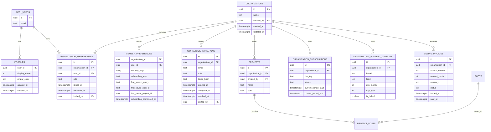

# feat: Add Profile Onboarding and Organisation Admin

## Overview

Add a profile view discovered by clicking the avatar in the dashboard header. The profile view becomes the user's home for onboarding, industry preferences, subscription tier selection, billing history, and team administration.

This feature also introduces first-class organisations. New sign-ups create an organisation and make the signing user its admin. Invited users join an existing organisation as a member or admin, depending on the invite. Saved projects and trend data move from being owned by a single user to being owned by the organisation, so removing a team member immediately removes their access without deleting shared research.

## Problem Statement

TrendCue currently has a single-user ownership model:

- Supabase Auth creates users in `auth.users`.
- `projects.user_id` scopes saved trend projects to one user.
- The dashboard header displays an avatar, but it is not a navigation entry.
- Sign-up only asks for email and password.
- Discover content is global and not guided by user niche preferences.
- There is no role model, billing surface, team management, or onboarding state.

The requested profile and admin workflows need clearer account boundaries. Billing and member removal cannot be protected only by hiding UI controls; the database must know which organisation a user belongs to and which role they have.

## Goals

- Let users open a profile view from the dashboard avatar.
- Let users start, resume, and complete guided onboarding from profile.
- Guide onboarding toward a meaningful first search and saving a first trend.
- Persist industry preferences and use them to rank or surface Discover content.
- Add three mock subscription tiers and payment method capture for paid tiers.
- Show admin-only billing history with downloadable past invoices.
- Let admins invite members by email, assign a role, and remove members.
- Add organisation creation to sign-up, with the signing user created as admin.
- Support invited users joining an existing organisation instead of creating a new one.
- Enforce all member, admin, and billing boundaries with Supabase RLS and server checks.

## Non-Goals

- Real payment processing, Stripe webhooks, real invoice objects, or charging cards.
- Full multi-organisation switching UI. The schema should allow multiple memberships, but the first implementation can select the active organisation from the user's only active membership.
- Granular custom permissions beyond the MVP role set.
- Real outbound email infrastructure if no email provider is configured. The invite flow should store email invites and can expose a copyable invitation link as the mock delivery path.

## Proposed Solution

### Product Shape

Add a full profile/settings view inside the existing dashboard shell:

- The avatar becomes a button that opens the `profile` view.
- Profile contains user-accessible sections:
  - Onboarding
  - Industry preferences
  - Account summary
- Admin users also see:
  - Plan and payment method
  - Billing history and invoice downloads
  - Team members and invitations

Use the existing client shell pattern in `src/components/app-shell.tsx` for the first pass. A dedicated route such as `/dashboard/profile` can be introduced later if the app starts moving away from tab-state navigation.

### Role Model

MVP roles:

| Role | Intended user | Can use Discover and Projects | Can edit own preferences | Can manage billing | Can invite/remove team | Can assign admin role |
| --- | --- | --- | --- | --- | --- | --- |
| `admin` | Organisation owner/admin | Yes | Yes | Yes | Yes | Yes |
| `member` | Research user | Yes | Yes | No | No | No |

Rules:

- Every organisation must have at least one active admin.
- A user cannot remove or demote the last active admin.
- Removed members keep their `auth.users` account but lose access to organisation rows through RLS.
- Members should not be able to read billing, payment method, invoice, or invitation data even if they call Supabase directly.

### Sign-Up and Organisation Creation

Update sign-up to support two entry paths:

1. New organisation path:
   - User enters email, password, and organisation name.
   - After Supabase sign-up/session creation, call an idempotent `create_organisation_for_current_user(org_name)` RPC.
   - RPC creates `organizations`, active admin `organization_memberships`, default member preferences, and an optional default project.
2. Invitation path:
   - User lands on `/invite/[token]` or equivalent.
   - If unauthenticated, they sign up or sign in.
   - After auth, `accept_workspace_invitation(token)` verifies the token, matches the invited email to the authenticated user's email, and creates an active membership in the invited role.
   - Invitation acceptance should not create a new organisation.

Avoid storing authorization decisions in user-editable metadata. Supabase documents that user metadata can be changed by authenticated users, so roles should live in protected application tables and RLS helper functions.

### Onboarding Flow

Onboarding is available to every active member from the profile view.

Suggested steps:

1. Choose industries or niches.
2. Pick or edit a suggested first search query based on those industries.
3. Run the search in Discover using existing loaded posts and search logic.
4. Save one trend/post into a project. If no project exists, create a default project such as `First trends`.
5. Mark onboarding complete and show a completion state in profile.

Persistence:

- Store progress per user per organisation, not globally, so invited users can onboard inside the workspace context.
- Resume partial progress after refresh.
- Completion should be idempotent; saving another trend later does not reset onboarding.

### Industry Preferences and Discover Relevance

Persist selected industry keys on the member's organisation-specific preferences. Use them to influence Discover without hiding all other content:

- Highlight matching explore topics.
- Sort matching clusters and posts higher on the general Discover home.
- Seed onboarding search suggestions with preferred industries.
- Fall back to the existing global feed when no preferences are set.

Initial industry taxonomy can be a TypeScript constant in `src/lib/industries.ts`, mapped to hashtags, cluster ids, and regex matchers. Move it to the database later if non-engineers need to edit it.

### Mock Billing

Add three mock tiers:

- `starter` - free
- `growth` - paid
- `scale` - paid

Admin flow:

- Admin chooses a tier in profile.
- If the selected tier is paid, show a mock payment form.
- On submit, discard full card number and CVC immediately.
- Persist only non-sensitive display fields such as brand, last4, expiry month/year, billing name, billing email, and a mock provider id.
- Create or update the organisation's mock subscription row.
- Seed or generate mock invoices for billing history.

This keeps the UI realistic while preserving a clean path to Stripe later. Stripe's current guidance favors hosted Checkout/Customer Portal or Stripe Elements/Checkout Sessions for payment collection so card data does not pass through application servers.

### Billing History and Invoice Downloads

Admin-only billing section:

- Shows invoice number, period, amount, status, issued date, and paid/download action.
- Download action calls a route handler or server action that verifies the current user is an admin for the invoice's organisation before returning a file.
- For the mock phase, generate a simple invoice download from stored invoice data. The route can return a printable HTML/text document with `Content-Disposition: attachment`; a future Stripe integration can replace this with Stripe hosted invoice PDFs.

Members should not see the billing section and should receive no invoice rows from RLS.

### Team Invitations and Removal

Admin team section:

- List active members with email, role, joined date, and status.
- Invite by email and role.
- Show pending invitations with resend/copy-link/revoke affordances.
- Remove an active member after confirmation.

Data rules:

- Store invitation tokens hashed, not in plaintext.
- Expire pending invitations.
- Enforce one active membership per user per organisation.
- Enforce one pending invitation per email per organisation, or intentionally replace the previous pending invite.
- On removal, set `removed_at` or status `removed` instead of deleting the row. This preserves audit history and lets RLS exclude inactive memberships.
- Block removing the final admin.

## Technical Approach

### Architecture

The existing stack is Next.js 15 App Router, React 19, Supabase Auth, Supabase Postgres with RLS, and Tailwind CSS v4. Keep the implementation aligned with the current app:

- Client dashboard shell remains the first integration point.
- Supabase browser client reads user-visible rows through RLS.
- Route handlers or server actions handle sensitive actions that need additional authorization checks or generated downloads.
- Database functions handle transactional organisation creation, invitation acceptance, member removal, and last-admin protection.

### Schema Sketch

### RLS and Authorization

Create helper functions in a non-exposed schema when needed:

- `private.is_org_member(org_id uuid)` returns true for active memberships.
- `private.has_org_role(org_id uuid, allowed_roles text[])` returns true for active memberships with an allowed role.
- `public.create_organisation_for_current_user(org_name text)` creates organisation, admin membership, default preferences, and optional default project.
- `public.accept_workspace_invitation(invite_token text)` validates token and email, then creates membership.
- `public.remove_organization_member(member_id uuid)` blocks final-admin removal and marks membership removed.

Policy guidance:

- Enable RLS on every new public table.
- Use `to authenticated` in policies.
- Use `(select auth.uid())` patterns for Supabase RLS performance.
- Avoid deprecated `auth.role()` and `auth.email()` helpers.
- Avoid using `raw_user_meta_data` for roles or billing access.
- Add explicit filters in Supabase client queries even though RLS is authoritative, so Postgres can plan better.

Admin-only tables:

- `organization_subscriptions`
- `organization_payment_methods`
- `billing_invoices`
- `workspace_invitations`

Member-visible tables:

- Own profile.
- Own member preferences.
- Active organisation membership summary.
- Organisation projects and saved posts for active members.

### Migration Strategy

1. Create new organisation, membership, preference, invitation, billing, and invoice tables.
2. Backfill one organisation per existing `projects.user_id` where needed.
3. Add `projects.organization_id` and `projects.created_by`.
4. Backfill existing projects to the user's organisation.
5. Update `project_posts` policies to authorize through the project's organisation membership.
6. Keep `projects.user_id` temporarily if needed for rollback, then plan a later cleanup migration.

If the database has no real production users yet, the backfill can be simpler, but the migration should still preserve existing saved project references.

## Implementation Phases

### Phase 1: Organisation Foundation

- Add migration for organisations, memberships, profiles, member preferences, invitations, mock billing, and RLS helper functions.
- Backfill existing `projects` into organisations.
- Update RLS policies for `projects` and `project_posts`.
- Add TypeScript interfaces for organisation, membership, profile, preferences, subscription, payment method, invoice, and invitation rows.
- Add a small data-access layer in `src/lib/organization.ts` or similar for loading active organisation context.

Success criteria:

- Existing authenticated users can still load dashboard data.
- Project reads/writes work through organisation membership instead of direct `projects.user_id` ownership.
- Members cannot query billing tables.

### Phase 2: Sign-Up and Invite Acceptance

- Update `src/components/login-form.tsx` sign-up mode to collect organisation name when no invitation token is present.
- Add invitation token route/view if needed.
- Add organisation creation and invitation acceptance RPC calls.
- Add empty-state handling when an authenticated user has no active organisation.

Success criteria:

- New sign-up creates exactly one organisation and one admin membership.
- Invited sign-up joins the existing organisation and does not create a new one.
- Existing login remains unchanged for returning users.

### Phase 3: Profile View and Onboarding

- Make the avatar in `Header` clickable and open the profile view.
- Add `src/components/profile-view.tsx`.
- Add onboarding components for industry selection, first search, first save, and completion.
- Persist onboarding progress in `member_preferences`.
- Connect first search to existing `handleSearch`.
- Connect first save to existing project/save flow, creating a default project if needed.

Success criteria:

- User can start onboarding from profile, refresh midway, and resume.
- User can run a search from onboarding and see Discover results.
- User can save a first trend and complete onboarding.

### Phase 4: Preferences and Discover Ranking

- Add `src/lib/industries.ts` with industry taxonomy and matching helpers.
- Add industry preferences editor in profile.
- Adjust Discover home ordering to boost matching topics, clusters, and posts.
- Keep global Discover content available as fallback.

Success criteria:

- Preferences persist per user per organisation.
- Discover visibly surfaces relevant topics without becoming empty when preferences have few matches.

### Phase 5: Mock Billing and Team Admin

- Add admin-only profile sections for plan/payment, billing history, and team management.
- Add mock tier picker and payment method capture.
- Add invoice listing and download route.
- Add invitation creation/revocation and member removal flows.
- Add last-admin protection in both UI and database function.

Success criteria:

- Admin can choose a paid tier, enter mock payment details, and see a saved payment method summary.
- Admin can view invoice history and download past invoices.
- Admin can invite a member with a role.
- Admin can remove a member and the removed member loses organisation access.
- Member cannot access billing or team controls through UI or direct data reads.

### Phase 6: Documentation and Validation

- Update README architecture and ERD.
- Document mock billing limitations and future Stripe migration path.
- Document role model and organisation sign-up behavior.
- Add validation notes for RLS smoke checks.

## System-Wide Impact

### Interaction Graph

- Avatar click opens profile view.
- Profile onboarding updates `member_preferences`, which changes Discover ranking inputs.
- Onboarding first save calls project creation or project-post insert, which now authorizes through organisation membership.
- Sign-up creates Supabase Auth user, then organisation RPC creates organisation state.
- Invitation acceptance creates membership, which grants project/feed access through RLS.
- Admin tier update writes subscription and mock payment method rows.
- Invoice download route checks admin role before returning invoice content.
- Member removal updates membership status; subsequent Supabase queries no longer match active-member RLS policies.

### Error and Failure Propagation

- If organisation creation fails after Supabase sign-up, route the user to an organisation setup recovery screen instead of dashboard dead-end.
- If invitation token is expired, revoked, already accepted, or email mismatched, show a clear blocked state and do not create membership.
- If mock payment validation fails, keep the selected tier unsaved and avoid persisting partial payment method rows.
- If invoice download authorization fails, return 403 from the route handler and show a compact profile error.
- If a removed user's session remains valid, RLS still denies organisation rows; UI should sign them out or show no-workspace access.

### State Lifecycle Risks

- Partial sign-up could create an auth user without organisation. Mitigate with idempotent setup RPC and a no-organisation recovery path.
- Removing a member by deleting rows could erase audit history. Use soft removal.
- Moving projects from user to organisation ownership can orphan existing saved posts if backfill misses rows. Validate counts before and after migration.
- Multiple pending invitations for the same email can create confusion. Use a partial unique index or replace existing pending invitation.
- Last-admin removal can lock an organisation. Enforce in the database function, not only in UI.

### API Surface Parity

All access paths need the same permissions:

- Browser Supabase reads/writes.
- RPC functions.
- Route handlers for invoice downloads and invitation acceptance.
- Any future server actions.
- Any future Stripe webhook handlers.

### Integration Test Scenarios

- New user signs up, creates organisation, becomes admin, completes onboarding, and saves first trend.
- Invited user accepts invite, becomes member, completes onboarding, and cannot access billing/team data.
- Admin creates paid mock subscription, saves payment method summary, sees invoice history, and downloads an invoice.
- Admin removes a member; removed member refreshes dashboard and loses access to organisation projects.
- Attempt to remove the final admin fails.

## SpecFlow Analysis

### Core User Flows

1. First-time admin sign-up:
   - Sign up with email, password, organisation name.
   - Dashboard opens with active organisation context.
   - Avatar opens profile.
   - User completes onboarding and saves first trend.
2. Returning member profile:
   - Member clicks avatar.
   - Member updates industry preferences.
   - Discover boosts relevant content.
3. Admin billing:
   - Admin opens profile.
   - Admin chooses tier.
   - Paid tier requires mock payment method.
   - Admin sees subscription and invoice history.
4. Admin team management:
   - Admin invites user by email and role.
   - Invited user accepts.
   - Admin later removes member.
   - Removed member loses access.

### Edge Cases to Specify

- What should happen if a user has multiple active organisation memberships? MVP can choose the first and defer switching.
- What should happen to projects created by a removed member? Recommended: keep them organisation-owned and visible to remaining active members.
- Can a member leave voluntarily? Not required for MVP, but removal infrastructure can support it later.
- Are industry preferences personal or organisation-wide? Recommended: personal per organisation membership.
- Should mock invoices exist for the free tier? Recommended: show none for `starter`, seed paid invoices after paid tier selection.
- Should admin role assignment happen on invite only or also after invite acceptance? MVP can support role changes from team list if last-admin rules are enforced.

## Acceptance Criteria

### Functional Requirements

- [x] Clicking the dashboard avatar opens a full profile/settings view.
- [x] New sign-up collects organisation name and creates an organisation with the signing user as `admin`.
- [x] Invited users can join an existing organisation without creating a new organisation.
- [x] Active members can start, resume, and complete onboarding.
- [x] Onboarding guides users to choose industries, run a first search, and save a first trend.
- [x] Industry preferences persist per user per organisation.
- [x] Discover surfaces preferred-industry content ahead of generic content while preserving fallback content.
- [x] Admins can choose one of three mock subscription tiers.
- [x] Choosing a paid tier requires entering a mock payment method.
- [x] Mock payment method persistence stores only safe display metadata, not full card number or CVC.
- [x] Admins can view billing history.
- [x] Admins can download previous invoice documents.
- [x] Admins can invite team members by email and assign `admin` or `member`.
- [x] Admins can revoke pending invitations.
- [x] Admins can remove team members.
- [x] Removed members immediately lose access to organisation projects, saved trend data, billing, and team settings.
- [x] The last active admin cannot be removed or demoted.

### Non-Functional Requirements

- [x] RLS is enabled on every new table in the public schema.
- [x] Admin-only data is protected by database policies, not only hidden in UI.
- [x] RLS policies use `to authenticated` and avoid deprecated `auth.role()` / `auth.email()` helpers.
- [x] Invitation tokens are stored hashed.
- [x] Existing saved project references survive the migration.
- [x] Profile, onboarding, billing, and team controls are usable on desktop and mobile dashboard widths.
- [x] UI controls use the existing TrendCue visual language and avoid nested settings cards.

### Quality Gates

- [x] `pnpm run build` passes.
- [x] TypeScript passes with the new Supabase row types.
- [x] Manual RLS smoke test verifies member cannot read billing/payment/invitation rows.
- [x] Manual RLS smoke test verifies removed member cannot read organisation projects.
- [x] Migration validation confirms project count and project-post count before/after backfill.
- [x] Invoice download route returns 403 for non-admins.

## Files

Likely additions:

- `supabase/migrations/20260525_add_organizations_profile_admin.sql`
- `src/lib/organization.ts`
- `src/lib/industries.ts`
- `src/lib/billing.ts`
- `src/components/profile-view.tsx`
- `src/components/onboarding-flow.tsx`
- `src/components/industry-preferences.tsx`
- `src/components/billing-settings.tsx`
- `src/components/team-settings.tsx`
- `src/components/tier-picker.tsx`
- `src/app/invite/[token]/page.tsx`
- `src/app/api/invoices/[invoiceId]/route.ts`

Likely modifications:

- `src/components/app-shell.tsx`
- `src/components/login-form.tsx`
- `src/components/discover-view.tsx`
- `src/components/projects-view.tsx`
- `src/components/project-picker.tsx`
- `src/lib/types.ts`
- `src/lib/posts-db.ts`
- `src/app/dashboard/page.tsx`
- `README.md`

## Dependencies and Risks

- Supabase Auth sign-up behavior may differ depending on email confirmation settings. The plan needs a recovery path for authenticated users without an organisation.
- RLS helper functions must be carefully written to avoid recursion and exposed-schema security issues.
- Existing `projects.user_id` assumptions are spread through UI and database policies.
- Mock billing can accidentally normalize unsafe card handling. The implementation must discard full card and CVC values immediately.
- Invoice downloads need explicit route-level authorization because file downloads are easy to accidentally expose.
- Team invitations need a clear mock email/delivery story until a real email provider is configured.

## Future Stripe Migration

Keep mock billing fields provider-shaped:

- `stripe_customer_id` nullable on `organizations` or billing account table.
- `stripe_subscription_id` nullable on subscription rows.
- `stripe_payment_method_id` nullable on payment method rows.
- `stripe_invoice_id` and `hosted_invoice_url` nullable on invoice rows.

When moving out of mock mode:

- Use Stripe Checkout Sessions for subscription sign-up where possible.
- Use Stripe Customer Portal for payment method updates, subscription changes, and invoice history.
- Use webhooks as the source of truth for subscription and invoice status.
- Keep admin authorization in TrendCue before redirecting to Stripe-hosted billing surfaces.

## Documentation Plan

- Update README architecture diagram to include organisations, memberships, profile, and billing mocks.
- Update README database ERD.
- Add a short "Roles and organisations" section.
- Add a short "Mock billing" section that states no real payment processing occurs and no full card data is stored.
- Document invite acceptance behavior and local testing steps.

## Sources and References

### Internal References

- `README.md` - current architecture, auth, RLS, and schema overview.
- `src/components/app-shell.tsx` - current avatar/header, tab state, search, and project save orchestration.
- `src/components/login-form.tsx` - current email/password sign-up and sign-in flow.
- `src/components/discover-view.tsx` - current Discover home and topic surfaces.
- `src/components/projects-view.tsx` - current saved project UI.
- `src/lib/explore-topics.ts` - current topic matching approach.
- `supabase/migrations/20260429_initial_schema.sql` - current user-owned project schema and RLS policies.
- `supabase/migrations/20260430_add_posts_table.sql` - current shared posts table and authenticated read policy.

### External References

- Supabase RLS docs: https://supabase.com/docs/guides/database/postgres/row-level-security
- Supabase Auth docs: https://supabase.com/docs/guides/auth/
- Supabase Auth user data docs: https://supabase.com/docs/guides/auth/managing-user-data
- Supabase deprecated RLS helpers: https://supabase.com/docs/guides/troubleshooting/deprecated-rls-features-Pm77Zs/
- Next.js authentication guide: https://nextjs.org/docs/app/guides/authentication
- Next.js route handlers and middleware: https://nextjs.org/docs/15/app/getting-started/route-handlers-and-middleware
- Stripe Checkout docs: https://docs.stripe.com/payments/checkout
- Stripe Elements docs: https://docs.stripe.com/payments/elements
- Stripe integration security guide: https://docs.stripe.com/security/guide
- Stripe Customer Portal sessions: https://docs.stripe.com/api/customer_portal/sessions
